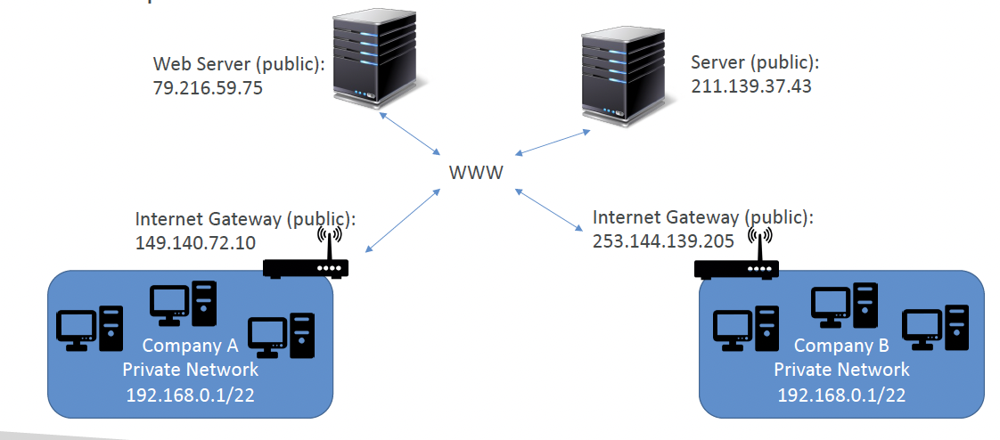
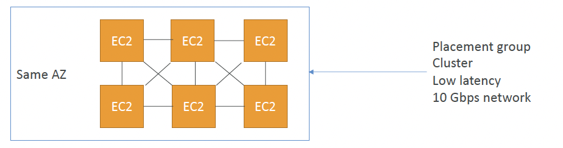
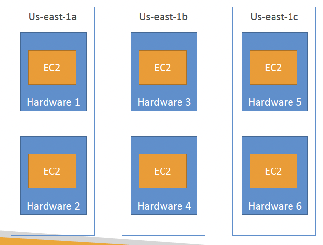
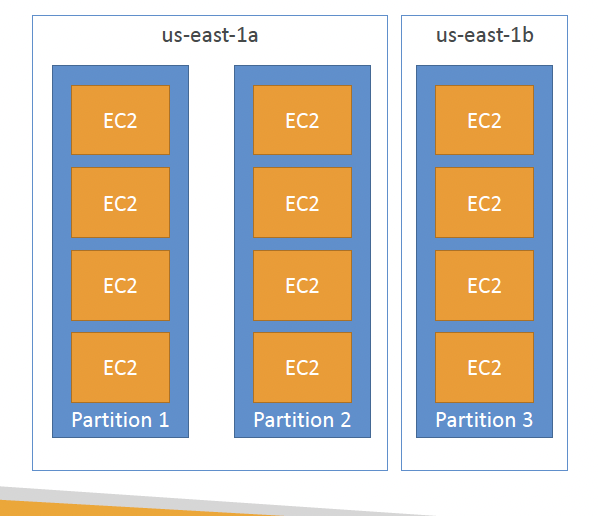

IP에는 누구나 알겠지만 2가지 종류의 IP 가 있다. v4와 v6이다. 
IPv4 형식: [0-255].[0-255].[0-255].[0-255]

이런 형식인데
IPv4는 37억개 정도의 

## Private vs Public IP

- public IP 
	- 인터넷에서 기기를 식별할 수있다. 
	- 전체 웹에서 고유해야 한다. (두 기기가 동일한 공용 IP 를 가질 수 없다.)
- private IP 
	- private IP : only Private network 안에서만 인식
	- 사설 네트워크 내에서는 고유해야 한다. 
	- 기기는 NAT + 인터넷 게이트웨어(프록시)를 사용하여 인터넷에 연결한다. 

### Elastic IPs 
Ec2에서 ssh를 사용할 때는 priavte ip 를 사용할 수 없다. 왜냐하면 VPN을 쓰지 않는 이상 같은 네트워크에 있는 것이 아니기 때문이다. 

Elastic Ip는 AWS 계정에 할당되는 정적 IP 주소로 , 필요에 따라 인스턴스 간에 재할당 할 수 있으며 계정당 5개까지만 가능하다. 

>[!주의]
>일반적으로 Elastic IP 사용을 피하는 것이 좋다. 
>종종 좋지 않은 아키텍처 결정을 반영한다. 대신에 랜덤 공용 IP를 사용하고 DNS 이름을 등록하는 것이 좋다. 혹은 로드 밸런서를 사용하고 공용 IP를 사용하지 않는 것이 좋다.

## Placement Groups (배치 그룹)

- **Cluster** - 인스턴스를 단일 가용 영역 내의 저지연 그룹으로 클러스터링
- **Spread** - 인스턴스를 기본 하드웨어 전체에 분산(가용 영역당 그룹당 최대 7개 인스턴스)
- **Partition** - 인스턴스를 가용 영역 내 여러 파티션(서로 다른 랙 세트 사용)에 분산. 그룹당 수백 개의 EC2 인스턴스로 확장 가능(Hadoop, Cassandra, Kafka)

파티션과 스프레드의 차이점은 무엇일까 <- 인스턴스 개수 제한인가

**클러스터**

미친 네트워크 성능 - 인스턴스 간 거리를 가까이 두어서 
단점 : 가용 영역에 장애가 발생하면 모든 인스턴스가 동시에 실패한다. 

사용 사례
- 빠르게 완료해야하는 빅데이터 작업
- 매우 낮은 지연 시간과 높은 네트워크 처리량이 필요한 애플리케이션 (고성능 컴퓨팅 워크로드에 적합하다)

**Spread**

하드웨어가 나누어져있어 하나의 하드웨어에서 장애가 나더라도 다른 Ec2가 있는 하드웨어는 영향을 받지 않는다. 
여기서 하드웨어는 서버라고 보면된다. 
가용 영역에 걸쳐 확장이 가능하기 때문에 동시 장애 위험임 감소한다. 
가용 영역당, 배치 그룹당 7개 인스턴스로 제한된다. 

고가용성을 최대화해야 하는 애플리케이션, 각 인스턴스가 서로의 장애로부터 격리되어야 하는 중요 애플리케이션

Partition

partition 하나당 하나의 랙을 의미한다. 
수백 개의 EC2 인스턴스를 지원할 수 있다. 한 파티션의 인스턴스는 다른 파티션의 인스턴스와 랙을 공유하지 않는다.

절전 모드의 비용은 어떻게 되나? 어느 상황에서 절전모드를 사용하는가

## ENI
ENI(Elastic Network Interface)는 마치 컴퓨터의 랜카드처럼 작동하는 AWS의 가상 네트워크 카드이다.

ENI 가 가질 수 있는 속성들 
- 기본 사설 IPv4, 하나 이상의 보조 IPV4
- 보안그룹

ENI의 장점은 독립적으로 생성해서 EC2 인스턴스에 바로 연결하고 사용하다 인스턴스에서 장애가 생기면 조치를 위해 ENI를 다른 인스턴스를 옮길 수 있다는 것이다. 

-> 주 서버와 백업 서버가 각각의 ENI 를 가지고 있다할 때 메인 서버가 다운시 메인서버의 ENI를 백업서버로 옮기면 사용자들은 서비스를 계속 이용하는데 무리가 없게 된다. 

제약이 있다고 하면 특정 가용 영역에만 바인딩이 된다.

## Hibernate 

인스턴스 종료와 중지
중지 : 디스크(EBS) 의 데이터는 다음 시작 시 그대로 유지된다. 
종료 : EBS 볼륨이 같이 날아간다. 

메모리를 인스턴스가 꺼질 때 EBS에 저장을 해둔다. 다시 키게 되면 해당 메모리 상태를 유지한채 Ec2를 사용할 수 있다. 

