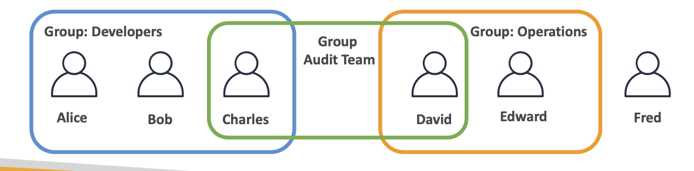
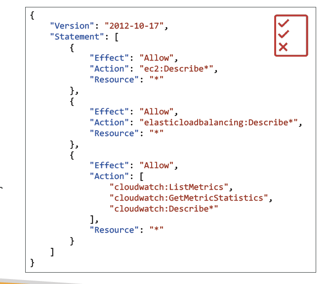
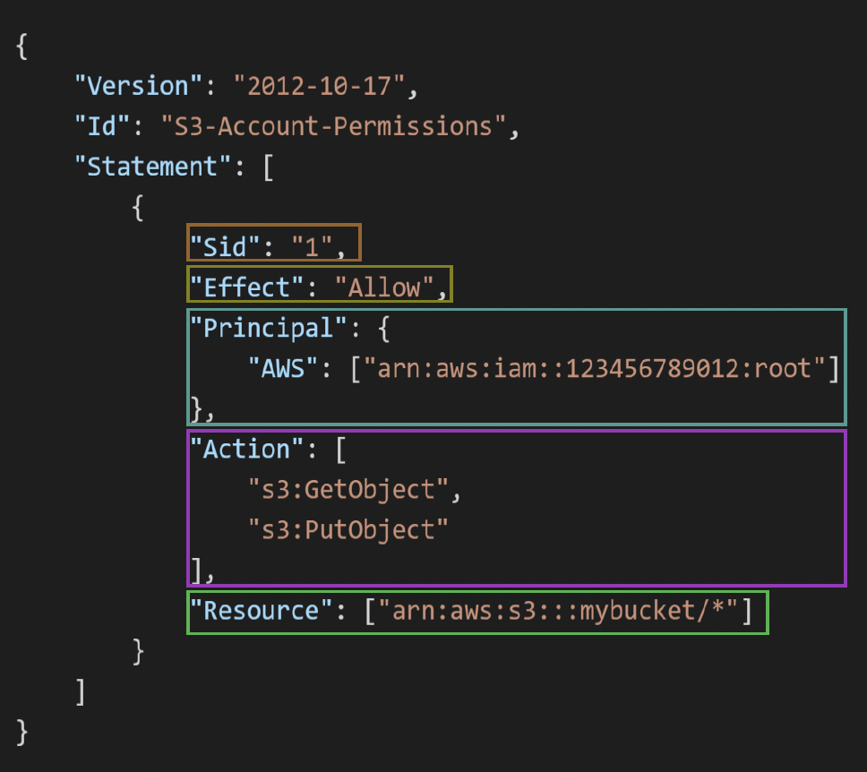

**IAM** : AWS의 글로벌 서비스로, AWS 리소스에 대한 접근을 안전하게 제어할 수 있도록 해주는 서비스이다 -> 클라우드 보안의 핵심이다!😉

AWS에서 어떤 서비스를 사용하든 IAM은 중요하다. 사용자와 그룹을 관리하고, 권한을 부여하여 AWS 리소스에 '누가' '어떤' 조건에서 접근, 이용 가능한지 통제하는 서비스이기 때문이다. 

시험에서도 비중있게 나오니 간단하다고 그냥 넘어가지 말고 잘 보면 좋을 것이다.

**Root Account** : 처음 만들 때 자연스럽게 생기는 거 , 그다음 사용시부터는 불편하더라도 Root 계정이 아닌 IAM 계정을 이용해 실습을 진행하자 
**Users** : 실제 사람
**Groups** : 개발팀, 엔지니어팀 처럼 비슷한 역할을 하는 사람들을 묶어서 관리, 단위

**권한(Permissions)** : AWS에서 어디까지 할 수 있니?
권한은 JSON 형태의 정책(Policy)으로 정의한다.

Json 파일로 권한을 부여하게 된다.

Action 에 사용할 서비스를, Resource에 자원을 넣게 된다. 

"최소 권한 법칙" : 보안과 안전성 때문에 항상 최소한의 권한을 부여해라 (Least Privilege Principle)

IAM 을 만들 때는 글로벌 서비스로 리전을 선택할 필요가 없다. 

실습의 흐름은
IAM 계정 만들기 -> group 만들기 + TAG (태그는 aws 모든 서비스에 붙일 수 있으며 "기술 관리부", "개발자" 이런 느낌이다) -> 정책 할당하기

## 🔡 정책 구조 

IAM 정책에는 일정한 형식이 있다.

- 📅 Version: 정책 언어의 버전이다. 현재는 "2012-10-17"을 사용하는데, 처음에 이 스펙이 만들어진 날짜라서 좀 오래 됐다.
- 🌐 Id: 정책을 서로 구분하기 위한 고유 이름으로 선택사항이다.(선택사항). 
- 📝 Statement: 정책의 ==핵심==이다. 하나 이상의 권한 구문으로 구성되는 부분으로(필수). 여기에 '무엇을 허용할지' 또는 '무엇을 금지할지' 정의하는 내용이 들어간다.

#### Statement 구문 구성

- 🏷 Sid: 구문 식별자다.(선택 사항) 이 구문이 어떤 목적인지 표시해주는 역할로. '개발환경-S3접근허용' 같은 식으로 이름을 지어주면 나중에 찾기가 편하다.

- 🔔 Effect: 이 구문이 접근을 허용(Allow)할지 거부(Deny)할지 지정

- 👤 Principal: 정책이 적용되는 계정/사용자/역할을 지정한다. 정책이 적용되는 대상을 정하는 것이다.

- 💪 Action: 이 정책이 허용하거나 거부하는 작업 목록으로 's3:GetObject', 'ec2:StartInstances' 같은 것들을 지정한다. 

- 💾 Resource: 작업이 적용되는 리소스 목록이다. 어떤 S3 버킷이나 EC2 인스턴스에 작업을 할 수 있는지 정해주는 것이죠. 저는 A, B, C 학생만 엌마에게 노트를 보여주고 싶어요! 처럼 어떤 리소스에 접근할지 정해주는 거예요. 🎯

- 🔍 Condition: 이 정책이 적용되는 조건을 정한다(선택 사항). 예를 들어 '특정 IP 주소에서 접속하는 경우에만', '오전 9시부터 오후 5시 사이에만' 같은 추가 제한조건을 주고 싶을 때 사용한다.

## 🔒 비밀번호와 보안

IAM 계정에 로그인 시에도 여러가지 비밀번호 정책과 보안을 설정할 수 가있다.
예를 들면 IAM 본인이 자신의 비번을 바꾸게 할 수도 있고 3개월에 한 번씩 비밀 번호를 바꾸라고 요구할 수도 있다. 

#### MFA
Multi Factor Authentication 으로 이중 보안을 설정하는 것이다.
비밀번호를 탈취 당하더라도 MFA 설정이 돼있으면 계정이 뚫리지 않는다. 

- 📱 가상 MFA 기기: Google Authenticator, Authy 같은 앱을 사용하는 방법이다. 가장 편하고 일반적인 방법으로 깃허브나 다른 서비스에도 적용해본 경험이 있을 것이다.
    
- 🔑 Universal 2nd Factor(U2F) 보안 키: YubiKey 같은 물리적 USB 기기를 사용하는 방법이에요. 
    - Yubico의 YubiKey(3자 제공)
    - 하나의 물리 기기로 여러 토큰 지원
    - 여러 루트 및 IAM 사용자에게 하나의 보안 키 사용 가능

- **하드웨어** 키 팝 MFA 기기
    - Gemalto 제공(3rd party)

- AWS GovCloud(US)용 **하드웨어** 키 팝 MFA 기기
    - SurePassID 제공(3rd party)

 